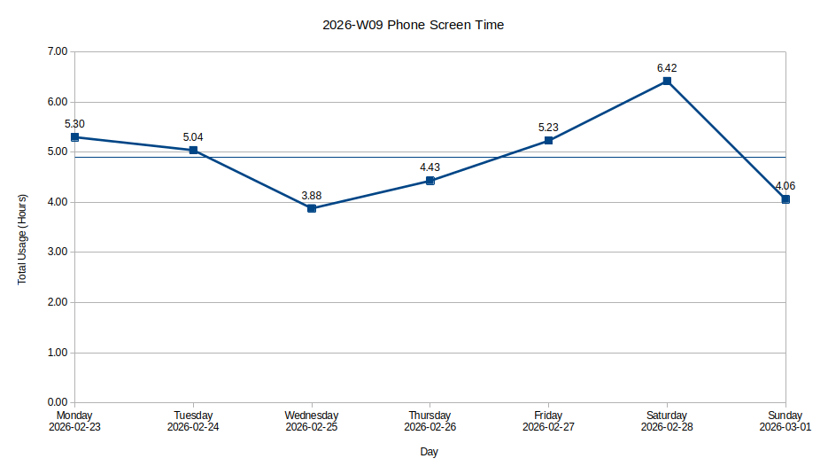

## 2025

This blog has been silent for all of 2025.

Under the heavy motivation of New Year, telling myself I'd write more posts throughout the year, I wrote a post on [1st of January 2025](/blog/extracting-discords-welcome-messages).
Then crickets 🦗 for the rest of the year.

> The greatest obstacle to blogging is the temptation to futz with your website instead of writing. Don’t succumb!"
>
> ~ [Ben Kuhn](https://www.benkuhn.net/writing/#:~:text=The%20greatest%20obstacle%20to%20blogging%20is%20the%20temptation%20to%20futz%20with%20your%20website%20instead%20of%20writing%2E%20Don%E2%80%99t%20succumb)

Checking the git history, I made only small cosmetic changes, and improvements and fixes to [tools](/tools) until August 2025.
Then in the next couple of months, I succumbed, and set out to rewrite this website.
After partial rewrites with Astro, Next.js and Svelte, I settled on Astro, and modified its blog starter kit to my liking.
Along the way, I lost about 4-5 draft blog posts which were stashed or committed locally, but not pushed to remote.
One thing I'm proud of after this rewrite is that, I've made sure to not break any URLs, because [cool URIs don't change](https://www.w3.org/Provider/Style/URI).

Enough with the history, let's snap back to the present.

## &#35;100DaysToOffload

I found a [submission](https://news.ycombinator.com/item?id=47170958) for [Setting up phones is a nightmare](https://joelchrono.xyz/blog/setting-up-phones-is-a-nightmare/) post written by [Joel](https://joelchrono.xyz/) on the front page of Hacker News.
I liked it and explored the website, where I found a link to [100 Days To Offload](https://100daystooffload.com/) in the footer.

> The whole point of #100DaysToOffload is to challenge you to publish 100 posts on your personal blog in a year.
>
> ~ [100 Days To Offload](https://100daystooffload.com/#:~:text=The%20whole%20point%20of%20%23100DaysToOffload%20is%20to%20challenge%20you%20to%20publish%20100%20posts%20on%20your%20personal%20blog%20in%20a%20year)

Sounds fun!

I've always been enthusiastic about blogging.
But when the time comes to sit down and write a post, my brain just doesn't take it.
It suffers from the shiny object syndrome.
The thought of blogging feels enticing but the act of starting is what fails.

100 posts in a year feels doable, and is a nice challenge and a motivator for me to keep blogging.

## Step aside, phone

Following this trail: [Joel's site](https://joelchrono.xyz/) → [100 Days To Offload](https://100daystooffload.com/) → [Dan's site and post](https://danq.me/2024/02/05/100-days-to-offload/) → [Kev's site and post](https://kevquirk.com/step-aside-phone) → [Manu's post](https://manuelmoreale.com/thoughts/step-aside-phone), I discovered another challenge called 'Step aside, phone'.

> ... for the next 4 weeks, each Sunday, we’re gonna publish screenshots of our screen time usage as well as some reflections and notes on how the week went.

Reflecting on my relationship with my phone, it's turned into a procrastination and attention-span-killing machine, which is not what I want.
This challenge is an attempt to fix that, reduce my screen time, and reflect on it every week.

Here are the screen time stats for the 2026-W09 week:

## In the end

I've decided to publish changes to the website only on weekends, and include the changes in the weekly notes.
This way, even if I have nothing interesting to write about (which is a rare occurrence :p), I can just write about the changes I make to the website.

Today is Monday, March 2, 2026.
It's a new month, a new week, and a nice even numbered day!
It's the perfect time to start these challenges.
शुभ काम में देरी क्यों? (Why wait to do something good?)

What I hope to gain from this:

- Have fun writing and sharing things
- Improve my writing
- Reduce phone screen time
- Make some internet friends? I've seen many people get introduced to each other through the indie web. Let's see how it goes.

That's all in today's post.
