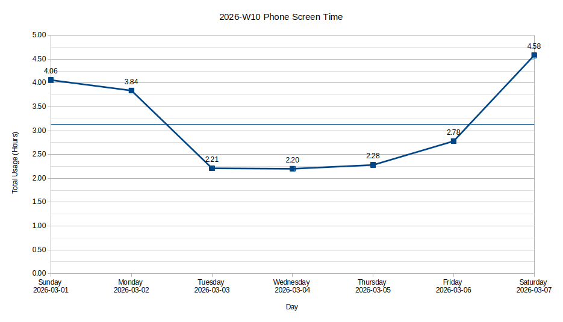
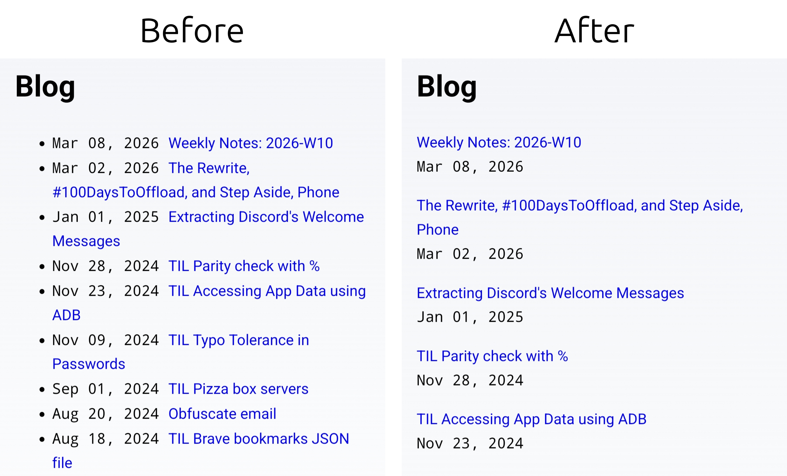

## Step Aside, Phone



In my day to day life, I follow the [ISO Week System](https://en.wikipedia.org/wiki/ISO_week_date):
Monday to Sunday is a week.
But for the purpose of the 'Step Aside, Phone' challenge, a week will be
Sunday of previous week + current week till Saturday.
This is because I write and publish these reflections on Sunday, so I can't include screen time stats of the same day since it's not over yet.

Previous week's average were 4.94 hours, and this week it reduced to 3.14 hours.

What changed? I'd say intention. I intentionally stopped touching my phone during office breaks, meals, after waking up, and all the times during the day where I'd mindlessly be on my phone previously.
I did use my phone to scroll Instagram, Twitter, and HackerNews for a couple of minutes at a time, but it was an intentional decision.
While this works, it requires some will power, which is finite, and not a solution for the long term.

I started this challenge on Monday.
On Tuesday, Wednesday, and, Thursday we can see the screen time drop.
But as the weekend approached, my will power reserves started to deplete.

On Friday, out of 2.78 hours, 1hr 22mins were spent scrolling Instagram after reaching home from work, and 51 mins in Firefox scrolling Twitter and HackerNews throughout the day.
On Saturday, out of 4.58 hours, I used Twitter for 40 mins, Instagram for an hour, Google Maps for 43 mins, and a train tracking app for 25 mins.

I've found that 2hr per day is an acceptable normal for a couple of weeks instead of going cold turkey at this stage.

## &#35;100DaysToOffload

This is my first weekly note.
I'm conflicted whether to count this as part of the #100DaysToOffload challenge.

On one hand this challenge is what gave me enough motivation to start writing,
without which this blog would've rot for another year.
On the other hand, counting weekly notes is an easy "win".
Out of 100 posts, around 40 would be weekly notes.

I think it's safe to count weekly notes under the challenge since it's my first year.
Once i gain momentum, things will get better and easier.
Sixty standalone posts feels like a lot to write at the current pace I'm going.
I better set a schedule for writing, maybe something like an hour of writing every other day so that I can be
consistent.

## Changes Since Release 2026.03.0

Changes I made to this website this week.

### Release 2026.03.1

- Made the [blog list](/blog/) page easy to read on mobile.
  The bullet list and its left padding took up valuable horizontal space before:

  

- Renamed blog in RSS and Atom feed.  
  I was trying to find my own feed in an RSS reader and it wasn't where I
  expected it to be when sorted by blog name.  
  Previous name: Blog | Shubh A Chudasama  
  New name: Shubh A Chudasama's Blog
- Reduced padding of code blocks in blog posts.
- Used radio buttons on [case converter](/tools/case-converter/) tool page.  
  The previous design--where output for all cases was shown--was difficult
  to use because finding the case you cared about was hard and required
  scrolling the page.
- Replaced `package.json` scripts with the [just](https://github.com/casey/just) command runner.
  `just` allows me to specify commands so that they depend on each other and run in an order.
- Fixed page meta description.  
  I accidentally used `undefined` from `astro:schema` package instead of using
  the `undefined` keyword. This caused the below to be set as description of
  all pages:

  ```js
  (params) => {
  	return new ZodUndefined({
  		typeName: ZodFirstPartyTypeKind.ZodUndefined,
  		...processCreateParams(params),
  	});
  };
  ```

  I found this bug while doing [POSSE](https://indieweb.org/POSSE) of my [previous post](/blog/the-rewrite-100-days-to-offload-and-step-aside-phone/)
  on other platforms. I was surprised that it wasn't caught when running `astro build`.
  Until now I never called `astro check` explicitly. Turns out this command caught the issue when I tried it during debugging, and so I set it up to be run before `astro build`.

### Release 2026.03.2

- Added redirect to my [signal profile](/signal/).  
  Recently, I started using signal again. The last time I used it was when it didn't yet support usernames.
  I already have redirects to my profile on

  - GitHub: [/github/](/github/)
  - LinkedIn: [/linkedin/](/linkedin/)
  - LeetCode: [/leetcode/](/leetcode/)

  These links are helpful during conversations where I can tell people the redirect URL to find my profile.

- Added a quote by Susam Pal. Go check it out on the [quotes page](/quotes/)!
- Changed all internal, feed, sitemap and redirect URLs to use a trailing slash.  
  Yesterday I woke up to this email by Google:

  > New reasons prevent pages in a sitemap from being indexed on site cshubh.com

  Here's a simplified explanation of this issue: When navigating to a URL without a trailing slash, GitHub Pages--where
  this site is hosted--responds with [HTTP 301](https://http.cat/301) redirect to the URL with a trailing slash.
  There's a slight delay due to this. My sitemap also used URLs without the trailing slash, hence the complaint from Big G
  that the content is not present where it's declared to be present in the sitemap.

  I used these resources to resolve this:

  - https://justoffbyone.com/posts/trailing-slash-tax/
  - https://github.com/slorber/trailing-slash-guide

- Removed `<link rel="canonical" href={canonicalURL} />` and added `<meta name="robots" content="noindex" />` to 404 pages.  
  I use a common layout for the whole site where metadata and body structure is set up.
  There was no special handling for 404 pages, and link rel canonical tag was added to those pages too which is not correct.
- Improved the wrapping of navbar to not wrap the site's name.
- Fixed nested `<p />` tag on the [projects](/projects/) page.

## What I Liked This Week

### Reading

- [The stranger secret: how to talk to anyone – and why you should](https://www.theguardian.com/lifeandstyle/2026/feb/24/stranger-secret-how-to-talk-to-anyone-why-you-should) - [(HackerNews discussion)](https://news.ycombinator.com/item?id=47214864)
  - This article lays out the way society and public behavior has changed these days, where small talk with strangers is becoming non-existent.
  - This is an actual problem which--I can personally relate to, and--needs to be talked about.
  - The concluding paragraph summarizes it perfectly:
    > Small talk may not profoundly alter your life. But its absence will profoundly alter human life as we know it. We live in a world of intense and often unnecessary division. Small talk is a tiny, free and very possibly priceless reminder of our shared humanity. If we intentionally give up talking to strangers, if we purposely decide to give in to the phone shield, the consequences will be horrible. Arguably, we are already on the verge of doing this. Let’s back up and start a conversation before it’s too late.
  - Do read the HN discussion too, it's good!  
    You'll find anecdotes, tips and advice from people who are good at socializing and small talk, with many citing that their personal and professional life improved because of being good at talking.
- [Demand for 2 Time Zones in India](https://www.drishtiias.com/to-the-points/paper1/2-time-zones-in-india)
  - This article is worth reading if you're interested to learn about the Indian Standard Time (IST).
  - I reached this article after reading that British Columbia is adopting year-round daylight time.
    I hopped on to Gemini to learn about IST and go to know about [Chaibagan time](https://www.drishtiias.com/to-the-points/paper1/2-time-zones-in-india#:~:text=In%20fact%2C%20tea%20gardens%20in%20Assam%20have%20long%20set%20their%20clocks%20one%20hour%20ahead%20of%20the%20IST%2C%20creating%20their%20own%20informal%20time%20zone%20%28Chaibagaan%20Time%29%2E) followed by tea gardeners in North East India.
- [Haskell Researchers Announce Discovery of Industry Programmer Who Gives a Shit](https://steve-yegge.blogspot.com/2010/12/haskell-researchers-announce-discovery.html)
  - This is a funny one. I just couldn't stop laughing while reading it. Developers have a weird sense of humor, no?
  - I found it through [this](https://news.ycombinator.com/item?id=47245930) comment on HN.

### Watching

- [Video on XZ Utils backdoor by Veritasium](https://www.youtube.com/watch?v=aoag03mSuXQ) which covers
  - The history of the FSF, GNU, and Linux
  - How compression works
  - RSA algorithm
  - IFUNC resolvers
  - The exploit
- Huberman Lab podcast: [Unlearn Negative Thoughts & Behaviors Patterns | Dr. Alok Kanojia (Healthy Gamer)](https://www.youtube.com/watch?v=9G2MRFs4vac)
  <!-- prettier-ignore -->
  - This is a 3 hour video. I watched it all in a single sitting and learnt a lot.
  - <details>
     <summary>Here are the chapters from the video</summary>

    - Alok Kanojia (Dr. K)
    - Internet, Computer Games; Academic Pressure
    - Millennials & Self-Awareness, Hijacking Mental Health Language
    - Personality & Individual Road Maps, Misdiagnosis
    - Ambiguity, Flirting, Social Skills Decline, Uncertainty Tolerance
    - Dating in the Internet Age, Cognitive Bias
    - Healthy Distress Tolerance, Tool: How to Feel Your Feelings
    - Expectations vs Internal Desire Roadmap, Western vs Eastern Theory of Mind, Ego
    - Sense Organs, Comparison & Proving Oneself, Internal Drive
    - Internet, Ego, "Teflon Buddha", Tool: Dealing with Criticism
    - Observing One's Mind, Meditation, Psychedelics
    - Tool: Shunya "Void" Meditation & Resilience
    - External Reminders, Environment; Men & Emotional Regulation
    - Samskara, Yoga Nidra, Trauma & Learning, Shunya & Personal Compass
    - Yoga Nidra, Channeling Divinity, Genius
    - Breathwork Practices; Meditation Science, Self-Esteem & Belief Change
    - Liminal States, Meditation Types & Benefits; Western & Eastern Balance
    - Understanding Ego & Perception; AI & Narcissism, Psychosis
    - Tool: Healthy Social Media Use, When To Not Use, Normal Standards
    - Social Media & Looks Obsession, Purpose, Charisma
    - Young Men Falling Behind?, Male Support, Suicide; Men in Relationships
    - "Stuck" Young Men, Failure to Launch, Tool: Motivation & Understanding Oneself
    - Pornography, Erectile Dysfunction, Emotions, Addiction; Relationships
    - Men & Love, Looksmaxxing, Rejection, Partner Characteristics, Tool: Walk Before Dates
    - Exploring Practices, Meditation, Breathwork
    - Spirituality, Personal Exploration; Acknowledgements
    </details>
