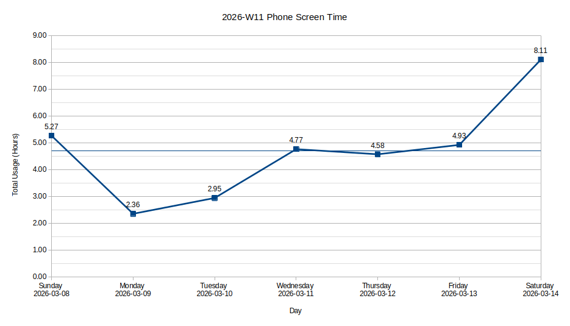

I got back to playing Ukulele this week after a month or so of not touching it.
I recorded myself singing and playing starting lines of [Ee
Raathale](https://music.youtube.com/watch?v=pnN9DNmohoo) and posted it on
[Instagram](https://www.instagram.com/p/DVyw2jPE6Nw/). The lyrics get harder
after those lines and the pitch gets higher than I can currently reach.

Today, I read [Willingness to look stupid is a genuine moat in creative
work](https://sharif.io/looking-stupid), a post by Sharif Shameem.

> The amount of stupidity you're willing to tolerate is directly proportional
> to the quality of ideas you'll eventually produce.

Most people play it safe. Including myself.

> I think there are two very different failure modes here, each at an opposite
> end of the spectrum:
>
> 1. **Overshare, but look stupid:** You have lots of ideas, and you share them
>    indiscriminately. You look stupid because you don’t really care about what
>    you share, and people eventually learn to tune you out.
> 2. **Undershare, but never do anything interesting:** You have lots of ideas,
>    but share almost none of them. You’re afraid of looking stupid, so the
>    exceedingly few ideas that you do share end up being incredibly bland. You
>    never look stupid, but this comes at the expense of never doing anything
>    interesting ever again.

I definitely fall under the 2nd category. The perfectionist in me doesn't let
me post unrefined, spontaneous, thoughts or ramblings. That's a reason I lurk
on the internet and platforms like Twitter and HN instead of tweeting,
commenting and sharing my thoughts. Fear of embarrassment is another one. I'm
trying to offset it by being consistent on these weekly notes. But, these blog
posts are only possible because I spend 4-5 hours trying to get everything
right, writing, rewriting and editing multiple times so much so that I get into
this state:

> Spending too much time editing puts me in a mental state that’s similar to
> [semantic satiation](https://en.wikipedia.org/wiki/Semantic_satiation), but
> at the scale of a full essay or story. The words in front of my eyes begin to
> lose their meaning, ideas become muddled, and I can no longer tell if
> anything I’ve written makes sense at all. At that point, I have no choice but
> to walk away from the work and come back to it another day. It’s no fun.
>
> ~ Ankur Sethi in [Write quickly, edit lightly, prefer rewrites, publish with
> flaws](https://ankursethi.com/blog/write-bad-have-fun/)

I ought to finally read Austin Kleon's book [Show Your
Work!](https://austinkleon.com/show-your-work/) which I've been procrastinating
on since a year of getting to know about it.

## Step Aside, Phone



```
| Day       | App       | Duration | Notes                                  |
|-----------|-----------|----------|----------------------------------------|
| Sunday    | Firefox   | 2h 00m   | Saturday late-night Reddit rabbit hole |
|           | Instagram | 1h 41m   |                                        |
|           | Twitter   | 0h 12m   |                                        |
|-----------|-----------|----------|----------------------------------------|
| Monday    | Firefox   | 1h 43m   | HN, Twitter                            |
|-----------|-----------|----------|----------------------------------------|
| Tuesday   | Firefox   | 1h 10m   | HN, Twitter, Feeder                    |
|           | Feeder    | 0h 18m   |                                        |
|           | Droid-ify | 0h 06m   |                                        |
|-----------|-----------|----------|----------------------------------------|
| Wednesday | Firefox   | 3h 16m   | HN, Twitter, Feeder                    |
|           | Instagram | 0h 27m   |                                        |
|           | Feeder    | 0h 09m   |                                        |
|           | Droid-ify | 0h 06m   |                                        |
|-----------|-----------|----------|----------------------------------------|
| Thursday  | Firefox   | 2h 03m   | HN, Twitter                            |
|           | Instagram | 1h 53m   |                                        |
|-----------|-----------|----------|----------------------------------------|
| Friday    | Instagram | 2h 23m   |                                        |
|           | Firefox   | 2h 23m   | HN, Twitter, Feeder                    |
|           | Feeder    | 0h 07m   |                                        |
|-----------|-----------|----------|----------------------------------------|
| Saturday  | Instagram | 5h 15m   |                                        |
|           | Firefox   | 2h 04m   | HN, Twitter                            |
```

Last week's average was 3.14 hours, and this week it increased to 4.71 hours.

Earlier I used to use Feeder on Android to manage RSS subscriptions, and used
to read them regularly. Then a couple of months ago, I deleted the app to cut
down on screen time, and instead used Thunderbird on my laptop just to manage
feeds, but not actually read them. This Tuesday, I re-installed Feeder,
imported all the feeds from Thunderbird and started reading new posts to catch
up.

I found that Manu had successfully completed 4 weeks of this challenge and had
posted his [closing
thoughts](https://manuelmoreale.com/thoughts/step-aside-phone-closing-thoughts).
I took this opportunity to read all his posts about this challenge since when
he started it.

> I said I started because one thing I did this week was delete any app that’s
> related to content consumption from the phone. I think my personal goal for
> this month-long experiment is going to be to get back to a use of my phone
> that’s utility-driven and not consumption-focused. The phone should be a tool
> to do things and not a passive consumption device.
>
> ~ Manuel Moreale in [Step aside, phone: week
> 1](https://manuelmoreale.com/thoughts/step-aside-phone-week-1)

His posts reminded me that I too want to cut down on consumption, and move
towards creation. Consumption is the default for most folks including myself.
And I'd like to change that. For the past year or so, I haven't created
anything meaningful. All my projects start with excitement, fizzle out after a
couple of days, and get abandoned.

My content consumption was through the roof this week.

I received some exciting news on Tuesday morning. I was happy the whole day.
And as it happens and has always happened in the past, my mind counters that
with self destructive behaviors. This means excessive phone usage, staying up
late at night ruining the next day, nostalgia, regrets, and memories of the
past hitting me like a truck. I was impulsive for the whole week, and was on my
phone to avoid being with my own thoughts.

This tells me that, although I can be intentional about phone use and other
behaviors, it fails spectacularly when the usage happens impulsively. There's
no way to permanently fix this by following "productivity hacks" or shortcuts.
The fix has to be on the inside, a patch to my lifestyle, mindset, and my self.
I've started to take action on it from today, and will discuss its results in
about month.

## Changes Since Release 2026.03.2

Here are the changes I made to the website this week:

### Release 2026.03.3

- Improved attribution of some quotes on the [quotes page](/quotes/).

### Release 2026.03.4

- Generation of [Multiple QR Codes](/tools/qr-code-generator/) now works
  correctly.
  This feature was accidentally borked during [the
  rewrite](/blog/the-rewrite-100-days-to-offload-and-step-aside-phone/#:~:text=rewrite%20this%20website).
  Instead of rendering each input line as a separate QR code, it rendered all
  lines as a single QR code.

## What I Liked This Week

### Reading

- [mxgmn/WaveFunctionCollapse](https://github.com/mxgmn/WaveFunctionCollapse)
- [Building a Procedural Hex Map with Wave Function Collapse](https://felixturner.github.io/hex-map-wfc/article/) -- [HN Discussion](https://news.ycombinator.com/item?id=47311815)
- [The Gervais Principle, Or The Office According to “The Office”](https://www.ribbonfarm.com/2009/10/07/the-gervais-principle-or-the-office-according-to-the-office/) -- [HN Discussion](https://news.ycombinator.com/item?id=47286657)
- [Temporal: The 9-Year Journey to Fix Time in JavaScript](https://bloomberg.github.io/js-blog/post/temporal/) -- [HN Discussion](https://news.ycombinator.com/item?id=47336989)
- [Willingness to look stupid is a genuine moat in creative work](https://sharif.io/looking-stupid) -- [HN Discussion](https://news.ycombinator.com/item?id=47307124)

### Watching

- [Chiquita (2025)](<https://en.wikipedia.org/wiki/Chiquita_(film)>) movie.
  - This movie was recommended in replies to [this](https://x.com/aravind/status/1976839101111582998) tweet.

### Listening

- [Lane 8 - Nuclear Lethargy (Khåen Remix)](https://www.youtube.com/watch?v=7MjNTd-tpUo)
- [Tame Impala - Let It Happen (Official Audio)](https://www.youtube.com/watch?v=odeHP8N4LKc)
- [Pink Floyd - Breathe (2 hours loop version)](https://www.youtube.com/watch?v=QriGRDMRfjo)
- [Sad airplane · Tyler Burkhart](https://www.youtube.com/watch?v=8hF71eZjqgk)
